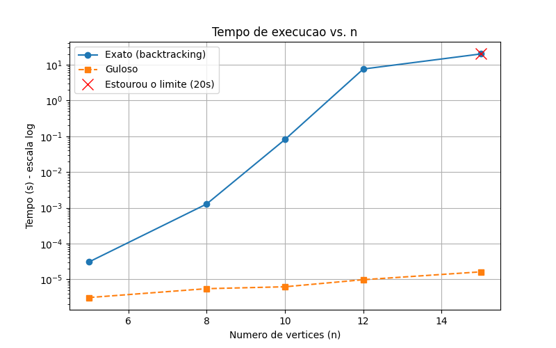
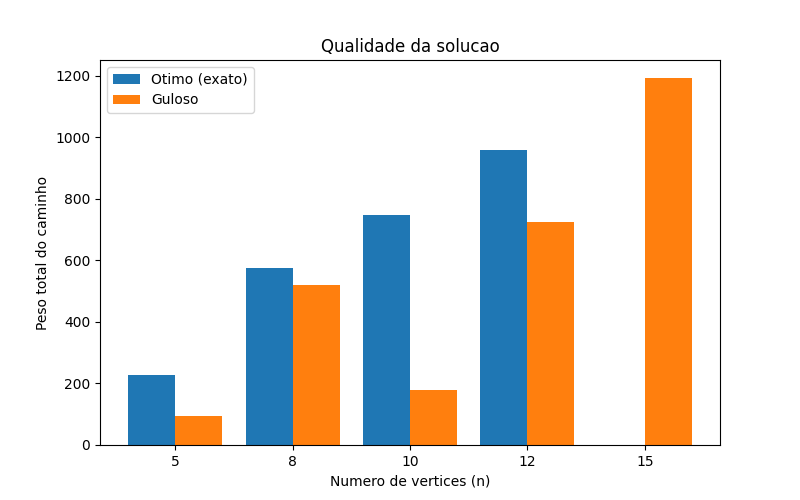

# Passeio Turístico Máximo - Caminho Mais Longo

**IC0004 - Algoritmos e Grafos**

| | |
|---|---|
| **Alunos** | Yves Luan do Rosário Moura e Patrick César Santos Silva |
| **Disciplina** | IC0004 - Algoritmos e Grafos |
| **Professor** | George Lima |
| **Data** | 01/07/2026 |

---

## Parte A - Complexidade e Redução Polinomial

Para tratarmos a dificuldade do problema no sentido de NP, consideramos a versão de decisão do Caminho Mais Longo e construímos uma redução polinomial a partir do Caminho Hamiltoniano, que é NP-Completo. Seguimos a definição de redução vista em aula, ou seja, uma função que transforma qualquer instância do primeiro problema em uma instância do segundo, em tempo polinomial, de forma que a resposta seja SIM em um se, e somente se, for SIM no outro. É a relação que o enunciado escreve como `Caminho Hamiltoniano <=p Caminho Mais Longo`.

> **Caminho Mais Longo (decisão).** Dados `G=(V,E)` não direcionado com pesos `w(u,v)>0`, vértices `S` e `D` e um inteiro `k`, existe caminho simples de `S` a `D` com soma de pesos maior ou igual a `k`?

> **Caminho Hamiltoniano (decisão).** Dado `G=(V,E)` não direcionado, existe caminho simples que passa por todos os `n=|V|` vértices uma única vez?

### Construção da redução (transformação da entrada)

Uma dificuldade aparece logo de cara. O Caminho Hamiltoniano não fixa onde o caminho começa nem onde termina, enquanto o Caminho Mais Longo exige uma origem `S` e um destino `D`. Resolvemos isso adicionando dois vértices artificiais, que acabam fazendo exatamente o papel do hotel e da praça do enunciado.

Seja `G=(V,E)` uma instância qualquer do Caminho Hamiltoniano, com `n=|V|`. Construímos uma única instância `(G', S, D, k)` do Caminho Mais Longo da seguinte forma:

- `G'` contém todos os vértices e todas as arestas de `G`;
- acrescentamos dois vértices novos, `s*` e `d*`;
- ligamos `s*` a todos os vértices de `V`, e `d*` também a todos os vértices de `V` (mas não criamos aresta entre `s*` e `d*`);
- toda aresta de `G'`, tanto as originais quanto as novas, recebe peso 1;
- por fim, `S = s*`, `D = d*` e `k = n + 1`.

A transformação cria 2 vértices e `2n` arestas novas e atribui peso às `O(n²)` arestas, então roda em tempo polinomial. Essa é a primeira exigência da definição; falta a segunda, que é a equivalência das respostas.

### Equivalência das respostas

**Ida.** Digamos que `G` tem caminho hamiltoniano `v1, ..., vn`. Então `s*, v1, ..., vn, d*` é um caminho simples de `s*` a `d*` em `G'`. A primeira e a última aresta existem porque `s*` e `d*` são vizinhos de todos os vértices de `V`, e o trecho do meio já era um caminho em `G`. Ele usa `n+1` arestas, todas de peso 1, então a soma é exatamente `n+1 = k`. Logo o Caminho Mais Longo responde "sim".

**Volta.** Agora consideramos que existe caminho simples de `s*` a `d*` em `G'` com soma maior ou igual a `n+1`. Como toda aresta vale 1, esse caminho tem pelo menos `n+1` arestas, ou seja, pelo menos `n+2` vértices. Só que `G'` tem exatamente `n+2` vértices e um caminho simples não repete nenhum. Então o caminho passa por todos eles, com `s*` e `d*` nas pontas e os `n` vértices de `V` no meio, em alguma ordem `v1, ..., vn`. Cada par consecutivo do miolo está ligado por uma aresta de `G'` entre vértices de `V`, e essas são exatamente as arestas originais de `G`, já que as arestas novas sempre encostam em `s*` ou `d*`. Portanto `v1, ..., vn` é um caminho hamiltoniano em `G`, e o Hamiltoniano responde "sim".

A transformação é polinomial e preserva a resposta nos dois sentidos. Portanto o Caminho Hamiltoniano se reduz polinomialmente ao Caminho Mais Longo e, como o Hamiltoniano é NP-Completo, o Caminho Mais Longo é **NP-Difícil**. Se existisse um algoritmo polinomial para ele, bastaria aplicar a transformação acima e resolveríamos o Hamiltoniano em tempo polinomial também. Além disso, com um caminho candidato como certificado, verificamos em tempo linear se ele é simples, se vai de `S` a `D` e se atinge `k`, então a versão de decisão está em NP. Juntando as duas coisas, ela é, na verdade, NP-Completa.

Vale comentar por que o Caminho Mais Curto é fácil e o Mais Longo não. No caminho mínimo, qualquer subcaminho de um caminho ótimo também é ótimo, e é essa subestrutura que o Dijkstra explora para construir a solução localmente. No caminho simples mais longo isso não vale, porque a restrição de não repetir vértice cria dependência entre as escolhas, e uma decisão boa agora pode inviabilizar o resto da rota. Essa é a raiz da dificuldade.

---

## Parte B - Implementação e Experimentos

Implementamos as duas abordagens em Python. Os grafos usados são completos, com pesos inteiros sorteados entre 1 e 100. Deixamos a semente do sorteio fixa (`random.seed(42)`) pra poder repetir o experimento e dar sempre o mesmo resultado. Em todos os testes a origem é o vértice 0 e o destino é o vértice `n-1`. Os tempos foram medidos num desktop com Ryzen 5 3500X e 16 GB de RAM, rodando Python 3.13 no WSL2 (Ubuntu).

### Solução exata (backtracking)

A ideia é um DFS recursivo que testa todos os caminhos possíveis de `S` até `D` e guarda o de maior peso. O detalhe importante é desmarcar o vértice na volta da recursão, para que ele possa ser usado de novo em outros caminhos. Guardamos o melhor peso e o melhor caminho em variáveis globais que a recursão vai atualizando, e colocamos um limite de tempo de 20 segundos, já que para grafos grandes a busca não termina (nesse caso a função devolve `None`).

```python
def buscar(g, n, atual, destino, visitado, peso, caminho, inicio, limite):
    global melhor_peso, melhor_caminho, estourou
    if estourou:
        return
    if time.time() - inicio > limite:
        estourou = True
        return
    if atual == destino:
        if peso > melhor_peso:
            melhor_peso = peso
            melhor_caminho = caminho[:]
        return
    for prox in range(n):
        if not visitado[prox] and g[atual][prox] > 0:
            visitado[prox] = True
            caminho.append(prox)
            buscar(g, n, prox, destino, visitado, peso + g[atual][prox],
                   caminho, inicio, limite)
            caminho.pop()
            visitado[prox] = False  # desmarca na volta


def resolver_exato(g, n, origem, destino, limite=20.0):
    global melhor_peso, melhor_caminho, estourou
    melhor_peso = -1
    melhor_caminho = None
    estourou = False
    visitado = [False] * n
    visitado[origem] = True
    buscar(g, n, origem, destino, visitado, 0, [origem], time.time(), limite)
    if estourou:
        return None, None
    return melhor_peso, melhor_caminho
```

### Solução gulosa (heurística)

O guloso é bem mais simples. Começa na origem e vai sempre pro vizinho ainda não visitado que tiver a maior aresta. Para quando chega no destino, ou quando fica preso sem ter para onde ir (beco sem saída).

```python
def resolver_guloso(g, n, origem, destino):
    visitado = [False] * n
    visitado[origem] = True
    atual = origem
    peso = 0
    caminho = [origem]
    while atual != destino:
        escolhido = -1
        maior = -1
        for prox in range(n):
            if not visitado[prox] and g[atual][prox] > maior:
                maior = g[atual][prox]
                escolhido = prox
        if escolhido == -1:
            return None, caminho  # beco sem saida
        visitado[escolhido] = True
        peso = peso + maior
        caminho.append(escolhido)
        atual = escolhido
    return peso, caminho
```

O restante do código (geração dos grafos aleatórios, laço dos experimentos e produção dos gráficos) está no arquivo [`src/caminho_mais_longo.py`](../src/caminho_mais_longo.py), entregue junto com este relatório.

### Tempo de execução

| n  | Exato           | Guloso   |
|----|-----------------|----------|
| 5  | 0,03 ms         | 0,003 ms |
| 8  | 1,3 ms          | 0,005 ms |
| 10 | 81,1 ms         | 0,006 ms |
| 12 | 7,58 s          | 0,010 ms |
| 15 | parou em 20 s   | 0,016 ms |



O eixo do tempo está em escala logarítmica. Nota-se que o tempo do exato sobe quase numa reta nesse gráfico, o que indica crescimento muito rápido (num grafo completo o número de caminhos de `S` a `D` é da ordem de `(n-2)!`). Já o guloso fica praticamente constante, perto de zero.

E onde a força bruta deixa de ser viável? Com `n=12` o exato já levou quase 8 segundos na nossa máquina. Com `n=15` precisamos interromper a execução, porque passou de 20 segundos sem terminar. Então é mais ou menos nesse ponto, entre 12 e 15 vértices, que a solução exata vira algo impraticável. O guloso resolve o mesmo `n=15` em alguns microssegundos.

### Qualidade da solução

| n  | Ótimo         | Guloso | Quanto pior |
|----|---------------|--------|-------------|
| 5  | 227           | 95     | 58,1%       |
| 8  | 574           | 521    | 9,2%        |
| 10 | 747           | 180    | 75,9%       |
| 12 | 960           | 726    | 24,4%       |
| 15 | não terminou  | 1192   | -           |



Olhando os casos em que a força bruta conseguiu terminar, o guloso ficou de 9% a 76% pior que o ótimo, sem nenhum padrão. Os casos `n=5` e `n=10` são os mais chamativos. Neles o guloso pega logo de cara a aresta mais pesada saindo da origem, que acaba levando direto ao destino, e o caminho termina com pouquíssimos vértices, deixando de fora boa parte do grafo.

O caso `n=10` deixa isso bem claro. O caminho ótimo encontrado pelo backtracking foi `0 -> 1 -> 7 -> 8 -> 4 -> 5 -> 6 -> 3 -> 2 -> 9`, passando por todos os 10 vértices e somando peso 747. Já o guloso saiu de 0, foi direto para o vértice 7 (que tinha a aresta mais pesada) e de lá caiu no destino 9, parando no caminho `0 -> 7 -> 9` com peso 180. Ou seja, ele terminou cedo demais e perdeu quase todo o grafo.

Por que o guloso erra? A gente quer maximizar a soma de um caminho que não repete vértice. Mas escolher sempre a maior aresta do momento pode (1) levar cedo demais ao destino e encerrar o caminho curto, ou (2) gastar um vértice que faria falta numa rota bem maior mais pra frente. Como o guloso nunca volta atrás, ele fica preso nesse ótimo local. Esse problema simplesmente não tem a propriedade de escolha gulosa que faz heurísticas assim funcionarem em outros problemas, o que faz sentido, já que ele é NP-Difícil.

### Resumindo o trade-off

- **Exato:** sempre acha o melhor caminho, mas o custo cresce como `(n-2)!` e fica inviável já por volta de `n=12` a `15` em grafos completos.
- **Guloso:** é muito rápido (`O(n²)` no pior caso) e sempre devolve alguma rota, mas sem garantia nenhuma de qualidade, podendo errar muito e às vezes nem chegar no destino.

---

## Referências Bibliográficas

1. CORMEN, T. H.; LEISERSON, C. E.; RIVEST, R. L.; STEIN, C. *Introduction to Algorithms*. 3. ed. Cambridge, MA: MIT Press, 2009.
2. GAREY, M. R.; JOHNSON, D. S. *Computers and Intractability: A Guide to the Theory of NP-Completeness*. San Francisco: W. H. Freeman, 1979.
3. SIPSER, M. *Introduction to the Theory of Computation*. 3. ed. Boston: Cengage Learning, 2013.
4. KARP, R. M. Reducibility Among Combinatorial Problems. In: MILLER, R. E.; THATCHER, J. W. (Eds.). *Complexity of Computer Computations*. New York: Plenum Press, 1972. p. 85-103.
5. LIMA, G. *Notas e slides de aula: Programação Dinâmica, Algoritmos Gulosos, Backtracking e Branch and Bound, e Introdução às classes P, NP e NP-Completo*. Instituto de Computação, UFBA, 2025.
6. HUNTER, J. D. Matplotlib: A 2D Graphics Environment. *Computing in Science & Engineering*, v. 9, n. 3, p. 90-95, 2007.
